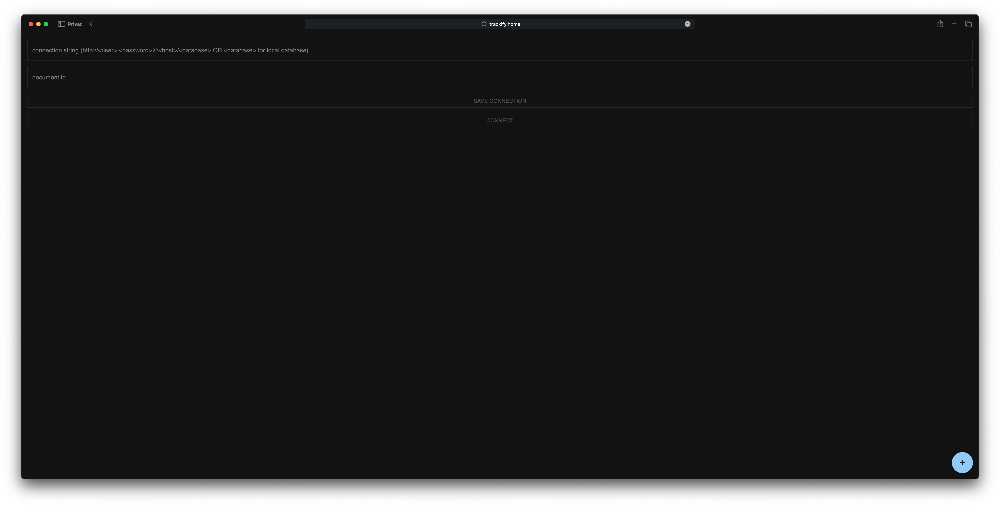
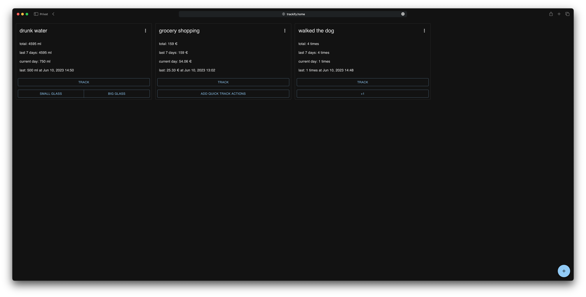
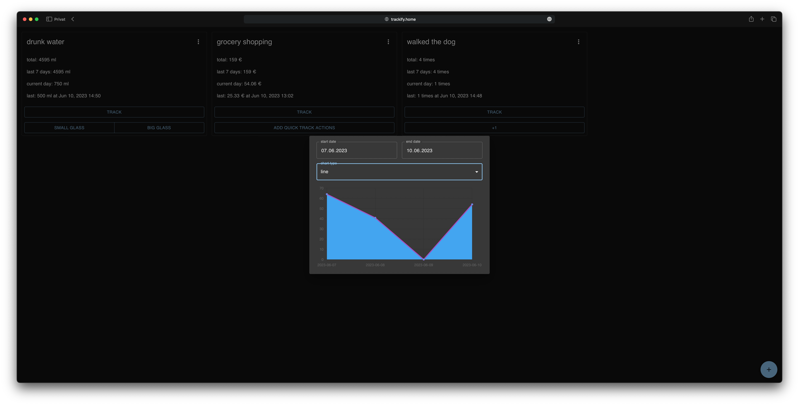

# A simple habit tracker

Trackify is an app that lets you track your daily habits. The app helps you to monitor important activities and routines in your life.

The data can be stored in an existing CouchDB database to keep the data synchronized between different devices. 
But there is also the possibility to use the browser memory.

For ChouchDB storage, only the connection string in the form of `http://<user>:<password>@<host>/<database>` and the document id must be entered. 
For local storage only any text has to be entered in the connection string field, e.g. `test`.

[Example (https://trackify.e-hess.com)](https://trackify.e-hess.com)

## Quick Start

### Using docker

```bash
docker run -it --rm \
    --publish 8080:80 \
    ghcr.io/eric-hess/trackify:latest
```

Now you can access the webpage via the following link: `http://localhost:8080`

### Using npm

1. Install dependencies:

```bash
npm install
```

2. Run the dev server:

```bash
npm run start
```

Now you can access the webpage via the following link: `http://localhost:3000`

## Docker Compose Example
[docker-compose.yml](./docker/docker-compose.yml)
```yml
services:
    trackify:
        image: ghcr.io/eric-hess/trackify:latest
        restart: unless-stopped
        ports:
            - 8080:80
    couchdb:
        image: couchdb:latest
        restart: unless-stopped
        ports:
            - 5984:5984
        volumes:
            - ./data:/opt/couchdb/data
            - ./config:/opt/couchdb/etc/local.d
        environment:
            - COUCHDB_USER=admin
            - COUCHDB_PASSWORD=YOURPASSWORD
```

## Screenshots

### Login / Connect


### Dashboard


### Activity Chart
